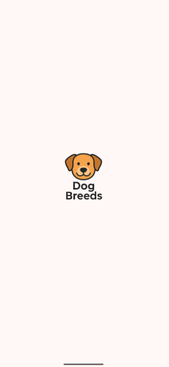
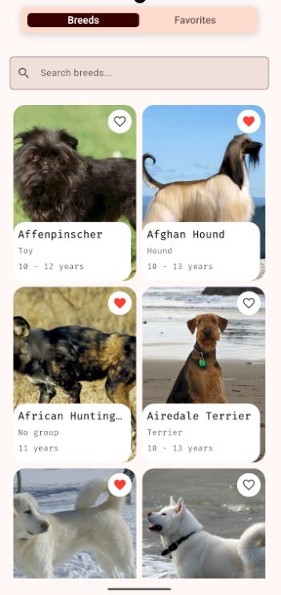
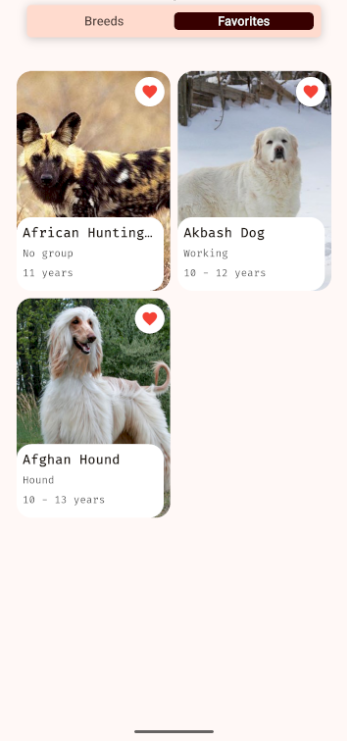
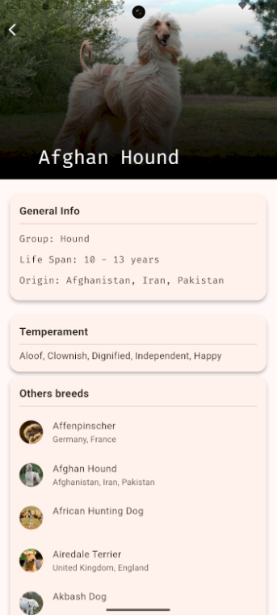

# 🐶 Dog Breeds App

[](https://flutter.dev)
[](https://dart.dev)
[](https://pub.dev/packages/provider)
[](LICENSE)

Aplicación móvil Flutter para consultar razas de perros utilizando **TheDogAPI**.  
Incluye buscador, detalle de razas, gestión de favoritos y arquitectura limpia con **Provider**.

---

##  Estructura del proyecto

```
lib/
├── core/               # Constantes, errores, helpers, router, services, theme
├── domain/             # Entidades, repositorios, casos de uso
├── infrastructure/     # Datasources, mappers, repositorios implementación
├── presentation/       # Providers y Screens (UI)
│   ├── providers/      # Providers (estado razas y favoritos)
│   └── screens/        # UI -> home, details, splash
└── main.dart           # Punto de entrada
```

---

##  Dependencias principales

```yaml
dependencies:
  dart_either: ^2.0.0
  dio: ^5.9.0
  flutter_launcher_icons: ^0.14.4
  go_router: ^16.2.2
  google_fonts: ^6.3.1
  provider: ^6.1.5+1

```

---

##  Requisitos previos

- Flutter **3.35.4** (channel stable)  
- Dart **3.9.2**  
- DevTools **2.48.0**

Verifica tu versión con:
```bash
flutter --version
```

---

##  Pasos para correr el proyecto

1. Clonar el repositorio:
   ```bash
   git clone <url-del-repo>
   cd app_tecnica_pets_api
   ```

2. Instalar dependencias:
   ```bash
   flutter pub get
   ```

3. Ejecutar la app:
   ```bash
   flutter run
   ```

---

##  Características

- **Clean Architecture** (domain, infrastructure, presentation).  
- **Provider** para manejo de estado.  
- **GoRouter** para navegación.  
- **TheDogAPI** como backend.  
- Soporte de **favoritos** con API.  
- **Google Fonts** y custom theme.  

---
## 📸 Capturas de pantalla

| Splash | Home | Favorites | Details |
|--------|------|-----------|---------|
|  |  |  |  |
---

##  Screens principales

- **Splash** → Pantalla inicial.  
- **Home** → Listado de razas + buscador.  
- **Favorites** → Razas favoritas.  
- **Details** → Detalle de cada raza.  
